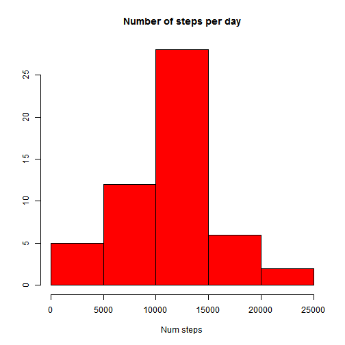
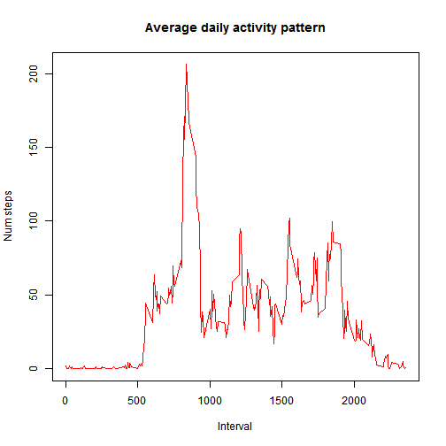
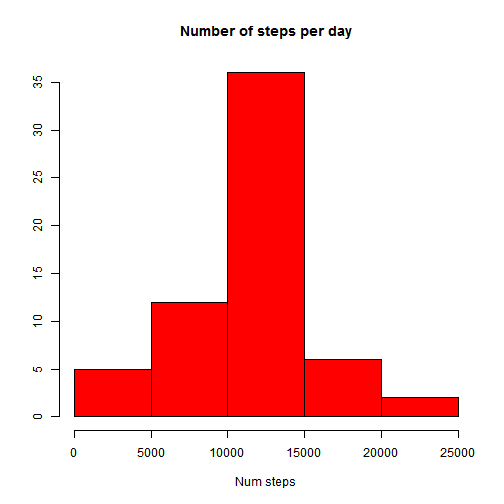
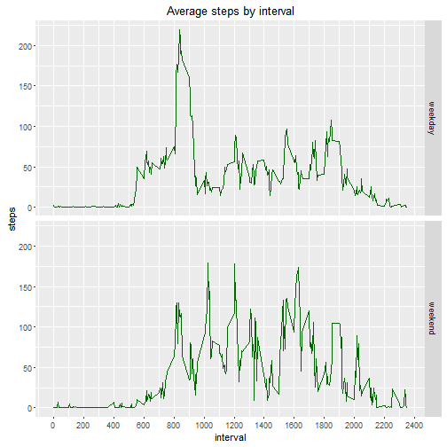
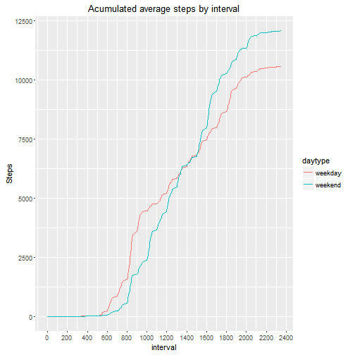

## Loading and preprocessing the data  

**1. Load the data**  

```r
activity<-read.csv("activity.csv")
```

**2. Process/transform the data (if necessary) into a format suitable for your analysis**   

We need to transform the "date" from factor type to date type


```r
activity$date<-as.Date(activity$date)
head(activity)
```

```
##   steps       date interval
## 1    NA 2012-10-01        0
## 2    NA 2012-10-01        5
## 3    NA 2012-10-01       10
## 4    NA 2012-10-01       15
## 5    NA 2012-10-01       20
## 6    NA 2012-10-01       25
```

```r
tail(activity)
```

```
##       steps       date interval
## 17563    NA 2012-11-30     2330
## 17564    NA 2012-11-30     2335
## 17565    NA 2012-11-30     2340
## 17566    NA 2012-11-30     2345
## 17567    NA 2012-11-30     2350
## 17568    NA 2012-11-30     2355
```

## What is mean total number of steps taken per day?
**1. Calculate the total number of steps taken per day** 


```r
sum_steps_days <- aggregate(steps ~ date, activity, FUN="sum")
head(sum_steps_days)
```

```
##         date steps
## 1 2012-10-02   126
## 2 2012-10-03 11352
## 3 2012-10-04 12116
## 4 2012-10-05 13294
## 5 2012-10-06 15420
## 6 2012-10-07 11015
```

**2. Make a histogram of the total number of steps taken each day** 


```r
hist(sum_steps_days$steps,main="Number of steps per day", xlab="Num steps",ylab="",col="red")
```

 

**3. Calculate and report the mean and median total number of steps taken per day** 

```r
mean_total_steps<-mean(sum_steps_days$steps,na.rm=TRUE)
median_total_steps<-median(sum_steps_days$steps,na.rm=TRUE)
```
The mean total number of steps per taken day is:

```
## [1] 10766.19
```

The median total number of steps per taken day is:

```
## [1] 10765
```

## What is the average daily activity pattern?
**1. Make a time series plot (i.e. type = "l") of the 5-minute interval (x-axis) and the average number of steps taken, averaged across all days (y-axis)** 


```r
mean_steps_interval <- aggregate(steps ~ interval, activity, FUN="mean")
plot(mean_steps_interval$interval,mean_steps_interval$steps,main="Average daily activity pattern", ylab="Num steps",xlab="Interval",type="n")
lines(mean_steps_interval$interval,mean_steps_interval$steps,col="red")
```

 

**2. Which 5-minute interval, on average across all the days in the dataset, contains the maximum number of steps?** 

```r
interval_max <- mean_steps_interval$interval[which.max(mean_steps_interval$steps)]
interval_max
```

```
## [1] 835
```


## Imputing missing values

**1. Calculate and report the total number of missing values in the dataset (i.e. the total number of rows with NAs)** 


```r
sum(is.na(activity$steps))
```

```
## [1] 2304
```

**2. Devise a strategy for filling in all of the missing values in the dataset. The strategy does not need to be sophisticated. For example, you could use the mean/median for that day, or the mean for that 5-minute interval, etc.**   
I will fill the data with the mean of the 5-minutes interval calculated previusly

**3. Create a new dataset that is equal to the original dataset but with the missing data filled in.**   
First I create a function "impute" in case the number of steps is NA then it is replaced with the mean of the 5 minutes interval.


```r
impute <- function(steps, interval) {
    if (is.na(steps)) {
        mean_steps_interval[mean_steps_interval$interval==interval,]$steps
    } else {
        steps
    }
}
activity_imputed<-activity
activity_imputed$steps <- mapply(impute, activity$steps,activity$interval)
head(activity_imputed)
```

```
##       steps       date interval
## 1 1.7169811 2012-10-01        0
## 2 0.3396226 2012-10-01        5
## 3 0.1320755 2012-10-01       10
## 4 0.1509434 2012-10-01       15
## 5 0.0754717 2012-10-01       20
## 6 2.0943396 2012-10-01       25
```

**4. Make a histogram of the total number of steps taken each day and Calculate and report the mean and median total number of steps taken per day. Do these values differ from the estimates from the first part of the assignment? What is the impact of imputing missing data on the estimates of the total daily number of steps?** 


```r
sum_steps_days_imputed <- aggregate(steps ~ date, activity_imputed, FUN="sum")
hist(sum_steps_days_imputed$steps,main="Number of steps per day", xlab="Num steps",ylab="",col="red")
```

 

```r
mean(sum_steps_days$steps,na.rm=TRUE)
```

```
## [1] 10766.19
```

```r
mean(sum_steps_days_imputed$steps,na.rm=TRUE)
```

```
## [1] 10766.19
```

```r
median(sum_steps_days$steps,na.rm=TRUE)
```

```
## [1] 10765
```

```r
median(sum_steps_days_imputed$steps,na.rm=TRUE)
```

```
## [1] 10766.19
```
The mean is the same but the median has increased.


## Are there differences in activity patterns between weekdays and weekends?

**1.Create a new factor variable in the dataset with two levels -- "weekday" and "weekend" indicating whether a given date is a weekday or weekend day.** 

```r
daytype <- function(day) {
    wd<-weekdays(day)
    if ((wd=="domingo")|(wd=="sábado")) {"weekend"}
    else {"weekday"}
}
activity_imputed$daytype <-mapply(daytype, activity_imputed$date)
```

**2. Make a panel plot containing a time series plot (i.e. type = "l") of the 5-minute interval (x-axis) and the average number of steps taken, averaged across all weekday days or weekend days (y-axis). The plot should look something like the following, which was created using simulated data:** 


```r
mean_steps_interval_imputed <- aggregate( steps ~ interval+daytype, activity_imputed, FUN="mean")

library(ggplot2)
g<-ggplot(mean_steps_interval_imputed,aes(x=interval,y=steps))
# Adding a title to the graph
g<-g+labs(title="Average steps by interval")
# Plotting the data ussing bar type 
g<-g+geom_freqpoly(colour="darkgreen",stat="identity")

# Laying out panels in a grid by type
g<-g+facet_grid(daytype~.)
g<-g+scale_x_continuous(breaks=seq(0,2400, by=200))
print(g)
```

 


I want to see the comparation of the acumulated steps during weekday and weekend

```r
wd<-  subset(mean_steps_interval_imputed,daytype=="weekend")
we<-  subset(mean_steps_interval_imputed,daytype=="weekday")
wd$steps.acu=cumsum(wd$steps)
we$steps.acu=cumsum(we$steps)
w<-rbind(wd,we)
```

And we plot the results 

```r
g<-ggplot(w,aes(x=interval,y=steps.acu, group=daytype))
g<-g + geom_line()
g<-g+labs(title="Acumulated average steps by interval")+ylab("Steps")
g<-g + geom_line(aes(colour = daytype))
g<-g+scale_x_continuous(breaks=seq(0,2400, by=200))
print(g)
```

 
